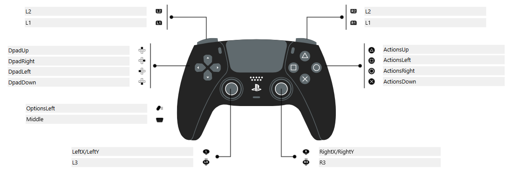
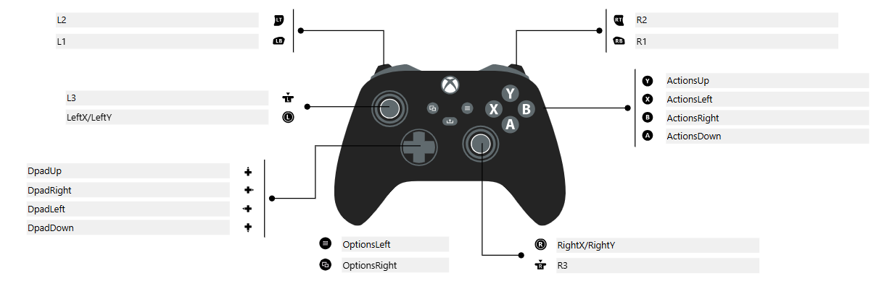

# Controller Support in MAutils

MAutils provides a unified and abstracted interface for game controllers, allowing seamless integration with multiple types of gamepads (e.g. PS5 and Xbox) without changing your robot control code.

All controllers extend the `MAController` abstract class, which defines a consistent set of button mappings and input methods.

---

## Supported Controllers

* **PS5 DualSense** – `PS5MAController`
* **Xbox Series Controller** – `XboxMAController`

Both use the same interface:

```java
MAController controller = new PS5MAController(0);
// Or:
controller = new XboxMAController(0);
```

---

## Button Layout (Unified Naming)

MAutils uses generic method names so your robot code works consistently across all supported controllers.

=== "PS5"
    

=== "Xbox"
    

Example:

```java
controller.getActionsUp(); // Maps to the Triangle button on PS5 or the Y button on Xbox
```

---

## Deadband Handling

Each controller has a calibrated deadband value to help eliminate small input noise:

| Controller | Default Deadband |
| ---------- | ---------------- |
| PS5        | `0.1`            |
| Xbox       | `0.3`            |

To apply deadband filtering:

```java
double value = controller.withDeadbound(rawValue);         // Uses default for controller
double custom = controller.withDeadbound(rawValue, 0.2);   // Uses custom value
```

This can be applied to stick positions or trigger axes as needed.

---

## Rumble Support

The `setRumble()` method allows vibration feedback, but note:

* Xbox controllers support rumble natively through the Driver Station.
* PS5 controllers do **not** support rumble reliably unless emulated as Xbox controllers, which is **not recommended** due to inconsistent behavior.

```java
controller.setRumble(0.5); // Activate rumble at 50% power
```

---

## Controller Logging

For diagnostics or special use cases, you can log controller input to NetworkTables:

```java
controller.log();
```

This records the current state of buttons and axes to:

```
/Controllers/{port}/[ButtonName]
```

Useful for testing in Shuffleboard or AdvantageScope.

---

## Sample Implementation

```java
@Override
public void teleopPeriodic() {
    if (controller.getL1()) intake.run();
    if (controller.getR2()) shooter.shoot();

    drivetrain.arcadeDrive(
        controller.withDeadbound(controller.getLeftY()),
        controller.withDeadbound(controller.getRightX())
    );

    controller.log();
}
```
